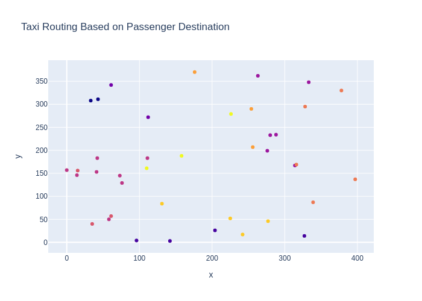

# taxi-routing

## Taxi routing based on passenger's destination.

-   Based on the postion of passengers and their destinations*, create their location groups using k-means clustering.
-   Find the distances of the location groups and the current location of the taxi and consider the nearest location group.
-   Go on serving the nearest passengers from the same location group and move onto the next nearest location group after serving everyone from the current group.

Passengers             |  Taxi Path
:-------------------------:|:-------------------------:
  |  
